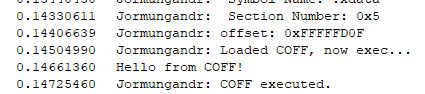

# Jormungandr

 

Jormungandr is a kernel implementation of a [COFF](https://en.wikipedia.org/wiki/COFF) loader, allowing kernel developers to load and execute their COFFs in the kernel.
The **only** supported type of COFF is an x64 kernel COFF (meaning, a COFF that uses functions from either NTOSKRNL or SSDT). This project is not supported to run with [VBS](https://learn.microsoft.com/en-us/windows-hardware/design/device-experiences/oem-hvci-enablement) enabled because it is using pools with execute permissions but this project should work for any version of Windows starting from Windows 7.

If you are unfamiliar with COFF and COFF loading, please refer to [TrustedSec's blog post about COFF loaders](https://www.trustedsec.com/blog/coffloader-building-your-own-in-memory-loader-or-how-to-run-bofs/).

## Basic Usage

To communicate with the driver, you can use and compile the [example](./Example/JormungandrExample.cpp) file with [CMake](#building-the-client).
This is an example of the most basic usage:

```cpp
int main() {
    HANDLE hDrv = CreateFile(DRIVER_NAME, GENERIC_WRITE | GENERIC_READ, 0, nullptr, OPEN_EXISTING, 0, nullptr);

    // ...

    BOOL result = WriteFile(hDrv, &data, sizeof(data), &bytesWritten, NULL);

    // ...
}
```

To run and execute the existing example, all you have to do is [create your own COFF](#writing-kernel-coffs) or use the [example](./ExampleKernelCoff/example.c):

```sh
JormungandrExample.exe example.out
```



## Writing kernel COFFs

To write a kernel COFF, create a new C file and import the functions you want as follows:

```c
DECLSPEC_IMPORT <FUNCTION_RETURN_TYPE> __cdecl <LIBRARY>$<FUNCTION_NAME>(<PARAMETERS>);
```

Replace the `<FUNCTION_RETURN_TYPE>` with the return type of the function you want, the `<LIBRARY>` can be either `ntoskrnl` or `ntdll` the rest is the signature of the function. After the function is imported, you can use it the way you are used to writing code.

To build the COFF, use `mingw` with the following command:

```sh
x86_64-w64-mingw32-gcc -c example.c -o example.out
```

## Setup

### Building the client

To compile the client, you will need to install [CMake](https://community.chocolatey.org/packages/cmake.install/3.13.1) and [Visual Studio 2022](https://visualstudio.microsoft.com/thank-you-downloading-visual-studio/?sku=Community&rel=16) installed and then just run:

```sh
cd <JORMUNGANDR PROJECT DIRECTORY>/Example
mkdir build
cd build
cmake ..
cmake --build .
```

### Building the driver

To compile the project, you will need the following tools:

- [Visual Studio 2022](https://visualstudio.microsoft.com/thank-you-downloading-visual-studio/?sku=Community&rel=16)
- [Windows Driver Kit](https://docs.microsoft.com/en-us/windows-hardware/drivers/download-the-wdk)

Clone the repository and build the driver.

## Testing

To test it in your testing environment run those commands with elevated cmd:

```cmd
bcdedit /set testsigning on
```

After rebooting, create a service and run the driver:

```cmd
sc create nidhogg type= kernel binPath= C:\Path\To\Driver\Nidhogg.sys
sc start nidhogg
```

## Debugging

To debug the driver in your testing environment run this command with elevated cmd and reboot your computer:

```cmd
bcdedit /debug on
```

After the reboot, you can see the debugging messages in tools such as [DebugView](https://learn.microsoft.com/en-us/sysinternals/downloads/debugview).

## Resources

- [TrustedSec's COFFLoader](https://github.com/trustedsec/COFFLoader)
